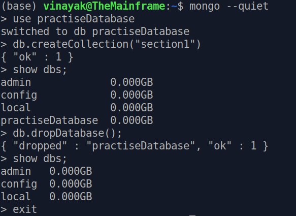
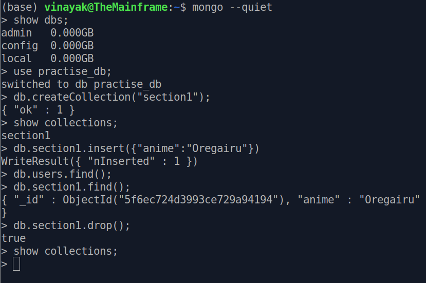
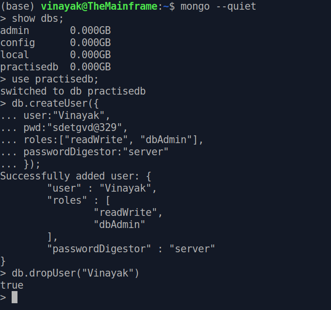

# Getting started with mongodb in ubuntu

**Starting a service in mongodb**
You can start a service in mongodb by typing
`sudo service mongod start`

To check the status of the running/closed services; basically to monitor the history of all the services, you can use the command
`sudo service mongod status`
States which are active indicate that those databases are running. 

To start the mongo shell, you can use the command
`mongo`

or alternatively
`mongo --quiet` 
to prevent the shell from printing initial text of large number of lines.

To stop the mongo shell, 
`exit`
will do the job.

To view all the available databases in the service, the command
`show dbs;`
will print out the databases.

**To create/delete a database**

- Decide on the name of your database and then type the command
    `use databasename;`
- Then create this database
    `db.createCollection("table1");`
- Then view if this database is added to the service by using
    ` show dbs;`
- Deleting an existing database
    `db.dropDatabase();`
- Then view if this database is deleted from the service by using
    ` show dbs;`

**Collections in mongodb**
Collections are like tables in SQL. In any database, you can have as many collections as you please which contain data pertaining to something unique to that collection. 

- Create a database and a collection within that database
    `use databasename;`
    `db.createCollection("section1");`
- Add an entry to the collection
    `db.section1.insert({"key":"value"});`
- Look at all the items in a collection (Similar to SELECT statement in SQL)
    `db.section1.find();`
- Delete a collection
    `db.section1.drop();`
- Look at the collections in the active database
    `show collections`
- Add multiple items to the collection
    `db.section1.insert([{"key":"value"}, {"key":"value", "k", "v"}, {"key":"value"}, {"ky":"vl"});`

**Adding/dropping user to/from a database**
You can add a user or drop one from accessing a database. The process is pretty straightforward.
- Select the database you want to add the user to
    `use databasename;`
- Now add the user with appropriate permissions
    `db.createUser({`
    `user:"Vinayak",`
    `pwd:"sdetgvd@329",`
    `roles:["readWrite", "dbAdmin"],`
    `passwordDigestor:"server"`
    `});`
- To drop a user, you just need to know his/her name. However only users with admin access can drop a user.
    `db.dropUser("username")`

**Querying from collections in mongodb**
You can query from a collection just like you do in SQL with some syntactc changes.
- Open the database, use it, find the collection which you want to query from.
- Query all pokemon from starters collection in pokemon db which belong to Kanto
    `use pokemon;`
    `show collections;`
    `db.starters.find({`
    `   "region":"kanto"`
    `}).pretty();`
- Query all pokemon from starters collection in pokemon db who have a cuteness of 80 or higher
    `use pokemon;`
    `show collections;`
    `db.starters.find({`
    `   "cuteness": { $gte: 80 }`
    `}).pretty();`
- Query all pokemon from starters collection in pokemon db who have a cuteness of lower than 70
    `use pokemon;`
    `show collections;`
    `db.starters.find({`
    `   "cuteness": { $lt: 70 }`
    `}).pretty();`
- Query all pokemon from Kanto region who have a cuteness of 80 or higher
    `db.starters.find({`
    `$and : [{"region":"kanto"}, {"cuteness": {$gt:80}}]`
    `});`
- Query all pokemon from Sinnoh or who have cuteness of less than 80
    `db.starters.find({`
    `$and : [{"region":"sinnoh"}, {"cuteness": {$lt:80}}]`
    `});`
- Query pokemon above cuteness of 80 or either from Kanto or Sinnoh regions
    `db.starters.find({`
    `"cuteness": {$gte: 80}, $or : [{"region":"kanto"}, {"region": "sinnoh"}]`
    `});`

**Updating records of items in a mongodb collection**
- Update piplup's cuteness from 60 to 55 in the starters collection of pokemon database
    `use pokemon`
    `show collections`
    `db.starters.update(`
    `{"_id":ObjectId("5f6ed2940b2cb921d0d76655")},`
    `{$set : {"cuteness":55} }`
    `);`

- Update charmander's cuteness to 90
    `use pokemon`
    `show collections`
    `db.starters.update(`
    `{"name": "charmander"},`
    `{$set : {"cuteness":90} }`
    `);`

- Update all kanto pokemon's cuteness to 90
    `use pokemon`
    `show collections`
    `db.starters.update(`
    `{"region": "kanto"},`
    `{$set : {"cuteness":90} },`
    `{multi: true}`
    `);`

**Using the "in" and "not in" operator in MongoDB**

- Find all the entries in starters collection of pokemon database which are either in kanto or in johto
    `use pokemon`
    `show collections`
    `db.starters.find({`
    `"region": {$in: ["kanto", "johto"]},`
    `});`

- Find all the entries in starters collection of pokemon database which are neither in kanto nor in johto
    `use pokemon`
    `show collections`
    `db.starters.find({`
    `"region": {$nin: ["kanto", "johto"]},`
    `});`

**Deleting records from a collection**
- Find all the entries which have the region johto and delete them
    `db.starters.remove({`
    `"region": "johto",`
    `});`

- Delete the entry with region sinnoh (only one not all the entries)
    `db.starters.remove({`
    `"region": "sinnoh",`
    `}, 1);`

**Projection of Fields**
If you only wanted to select a small number of fields from your database, then it could be done using projection of fields. Basically just like we are selecting only a few columns in SQL this could help us extract only a selct few keys from our records.

- Find the names of all pokemon from the kanto region
    `db.starters.find(`
    `    {"region":"kanto"},`
    `    {"name":1, "_id":0}`
    `    );`
Basically we pass in the filter first and the fields that we want as a binary variable next to get the fields of our choice. The id field needs to be explicitly shut as it's always by default turned on.

- Find only the names and cuteness of all the pokemon
    `db.starters.find(`
    `    {},`
    `    {"name":1, "cuteness":1, "_id":0}`
    `    );`

**Sorting data on select fields**
If you want to sort data in a collection, you can do so by specifying the key as the field on which you want to order and 1 for ascending and -1 for descending order based on the key. If you want to sort on multiple fields, you can do that by simply stacking the number of fields based on which you wanna do the sorting.

- Sort all pokemon based on cuteness and don't show their ids
    `db.starters.find(`
    `    {},`
    `    {"name":1, "cuteness":1, "_id":0}`
    `    ).sort({"cuteness":1});`

**Limit and skip commands**
The limit command limits the number of records upto which to retreive and skip command skips the number of records specified and starts fetching from the immediate next record. 

By themselves they're not so helpful but combined with all that we've learned they can really be of good value to us. Let's say we want to find the pokemon with second to last cuteness only.

`db.starters.find({}, {"name":1, "_id":0, "cuteness":1})`
`.sort({"cuteness":1})`
`.skip(1)`
`.limit(1);`

First I only selected the name and cuteness fields using Projection of fields. Next I sorted the data in ascending order of cuteness. Since I am interest in second to last cuteness, I skipped one record and then showed the first record of the resulting data. That's all about the basic commands of MongoDB.